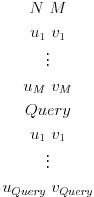

Total Order Labeling
====================

## Summary

- use __C++11__ (gcc 4.9.2)
- input graph must be __DAG__

## How to use

- Query

Is reachable from u to v ?

- Input Format

| variable | description |
|:-:|:--|
| N | number of vertices |
| M | number of edges |
| u_i, v_i | directed edge from u to v |
| Query | number of queries |

## TODO

- insert method implementation
- delete method implementation

## Reference

- Andy D. Zhu,  Wenqing Lin,  Sibo Wang,  and Xiaokui Xiao.  
"Reachability Queries on Large Dynamic Graphs: A Total Order Approach."  
Proceedings of ACM SIGMOD Conference on Management of Data (SIGMOD),  pages 1323-1334,  2014.
